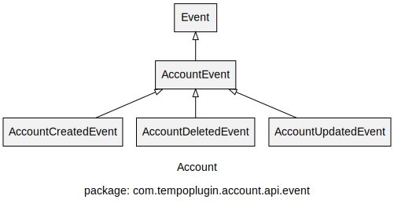
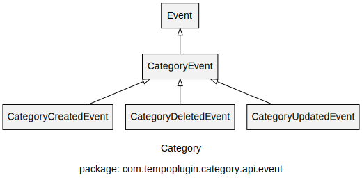
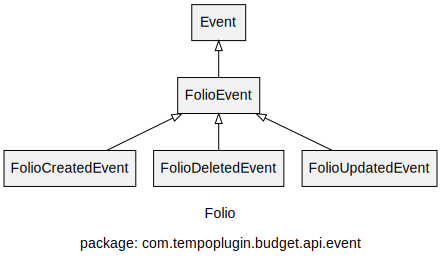
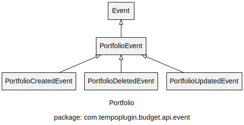
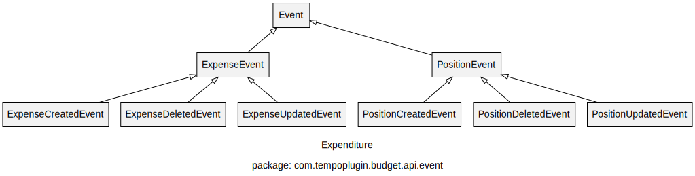

# JIRA Plugin for showcasing how to listen to Tempo Events

# Listening to events

[Writing JIRA event listeners with the atlassian-event library](https://developer.atlassian.com/server/jira/platform/writing-jira-event-listeners-with-the-atlassian-event-library)

# Root event class

All public Tempo events implements this :

    com.tempoplugin.platform.api.event.Event
    
Although this is helpful for discovering Tempo events, we do recommend that you listen to other 
fine-grained events (see the list below).

Most of the Tempo events have base classes that you can listen without the distinction of the nature 
of the event. For example, listening to `AccountEvent`, you will receive events like 
`AccountChangedEvent`, `AccountCreatedEvent`, `AccountDeletedEvent`, etc. 

Keep in mind that if for example you listen to `AccountEvent` __and__ `AccountChangedEvent`, both 
listening methods will be called.

# List of Tempo events

Class [hierarchy](doc/tempo-events.png) of the event classes.

## Tempo Accounts

### Account

### Category

### Customer

## Tempo Budgets

### Folio

### Portfolio

### Expenditure

## Tempo Planner

### Allocation

## Tempo Teams

### Team

## Tempo Core

### Work Attribute

## Tempo Timesheets

### Approval

